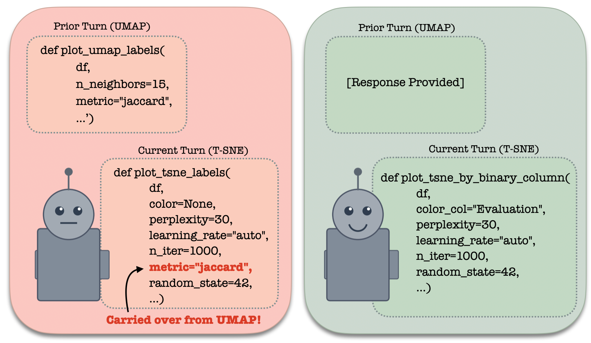

my mind digests information at a much slower pace than i tend to believe. in college, i could breeze through a math lecture at 2x speed, convinced i was following everything the professor said, only to stare blankly at a problem set, not knowing where to begin.

math started becoming more enjoyable when i slowed down and acknowledged that absorbing new information takes far longer than i typically would admit. i would pick out a handful of high-quality problems, learn them inside and out, notice exactly where i got stuck, and return to the same problem the next day with a fresh pair of eyes. after a certain point, i realized that i didn't actually need to consume that much information at all. understanding a new topic well was more about engaging deeply with a few core concepts.

i believe our brains are wired to get caught on simple problems for extended periods of time. we might toil over the same problem for months – thinking about it in the shower, on the bus, from multiple different angles and perspectives. great scientists and artists often do so for years.

> *i worry that the way ai has been introduced into our society is antithetical to the slow, non-linear type of thinking necessary for deep engagement with new ideas.*

when information is hurled at us at 200 miles an hour – packaged in a fluent, convincing voice – it becomes easy to accept answers at face value, rather than take the time to make sense of it at our own pace.

## ai can be used for slow thinking.
just as we now have democratized access to a tool for delegating work, we have one equally capable of facilitating deep thinking, the type necessary to reach states of new understanding and creativity: ai can follow a [feyman-esque](https://fs.blog/feynman-technique/) trail of questions, generate concrete examples, pull in documents, [rubber-duck](https://en.wikipedia.org/wiki/Rubber_duck_debugging), and play devil’s advocate.

ethicist and cognitive scientist josh offers a helpful rule of thumb for thinking about how to use ai for [intellectual tasks](https://joshdmay.substack.com/p/why-smart-people-make-weak-arguments): “you should use llms to generate inputs to your thinking, not outputs for others to read.”

## designing slow ai. 
lately, i've been thinking about how we might design ai to be more compatible with slow thinking.

first, the ai system should encourage the user to wrestle with the space of decisions that an llm needs to make along the way to generating its final response. just as understanding a mathematical proof requires wrestling with the underlying maze of failed paths along the way, becoming familiar with the full sequence of logical turns that make up the correct path, someone who receives an ai-generated response should be familiar with the major conceptual decision points that constitute the final response. what alternative responses could have been generated? and why might those responses be valid, or invalid? 

to test out this mode of human-ai interaction, we designed an interface that lays bare the [conceptual roadblocks](https://multiverse.csail.mit.edu/) – the conflicting assumptions, interpretations, and frameworks – that shape an llm’s response. the system allows users to work through a conceptual decision tree, a space of possible decisions and resulting outputs (see figure 1). confronted with a multiplicity of decision points, users in our study felt a stronger sense of ownership over the final llm-generated responses. when compared to a traditional linear chat interface, users were surprised to find how long it took them to settle on one response,[^2] and how much they learned about different viewpoints and along the way. our design draws inspiration from the concept of [multiverse analysis](https://pmc.ncbi.nlm.nih.gov/articles/PMC9636921/), a scientific method that specifies and runs a set of data-analytical choices, reporting results for each.

second, the system should present a range of plausible [viewpoints](https://arxiv.org/pdf/2402.05070). instead of generating standalone responses, one could imagine an ai that addresses queries in the form of [deliberations](https://knightcolumbia.org/content/representative-ranking-for-deliberation-in-the-public-sphere) between parties of [generative agents](https://arxiv.org/pdf/2304.03442). this discourse-style interface would act to surface the hidden assumptions and tradeoffs underlying each response. presenting responses in the form of discussion could be enough to encourage users to take on a more critique-like, rather than recipient-like, role.

third, system memory should be designed to prevent hidden assumptions from quietly accumulating in context. in [recent work](https://arxiv.org/abs/2602.24287), we find that, as chat histories progress, models tend to get caught in old pieces of code (see figure 2\) or vestiges of responses that are no longer relevant. this problem of models becoming [“more repetitive, and sometimes subtly wrong”](https://www.reddit.com/r/ChatGPT/comments/1qngpqa/does_chatgpt_quietly_get_worse_in_long/) as chat histories progress is a familiar headache. rather than linearly accumulating a full conversation transcript in context – tunnel-visioning the model with past lines of reasoning – we can design smarter, more structured ways to condition on the past. one way is to create a wide-angled view of chat history, representing past conversations as [knowledge graphs](https://github.com/MemPalace/mempalace/tree/develop). the model then conditions only on a high-level summary of the past, just enough to guide retrieval, while seeing the full conversation details when they become relevant.

finally, the system should respect that not every human problem deserves to be touched by an ai. in his book, [computer power and human reason](https://archive.org/details/computerpowerhum0000weiz_v0i3), joseph weisenbaum warns against consulting ai on tasks that require deeply human traits like empathy and wisdom. we can therefore design tools that encourage users to reflect on their [boundaries with ai](https://github.com/sanapandey/ai-boundaries). to do this, we created a chrome extension that allows users of chat interfaces to define (by placing a pin in a quadrant graph) how involved they’d like an ai’s response to be – from from direct, concrete responses to reflective questions back to the user – when presented with queries belonging to different areas of a user’s work and life. based on the preset boundaries, the tool produces a memory.md file that one can upload to any chat interface to serve as a guideline for the assistant.

## the dangers of a growing “fast ai” culture.

i worry that the culture of [autonomous ai](https://arxiv.org/pdf/2604.15597) is self-reinforcing: the less we engage, the harder it is to find our ways [back to engaging](https://blog.cosmos-institute.org/p/you-are-not-a-function).

when information is handed to us well-synthesized and on a silver platter, the line between which ideas are our own and which came from an ai begins to blur. without giving ourselves the time to think critically about what we receive, we risk drowning out our own [voices](https://arxiv.org/pdf/2603.18161). post-training pipelines may be unintentionally incentivizing agents to [steer user behavior](https://arxiv.org/pdf/2405.17713) toward states that are [easier to satisfy](https://arxiv.org/html/2504.03206v2#S1). indeed, [claude user trends](https://arxiv.org/pdf/2601.19062) show that disempowerment patterns in real-world llm usage are growing with time. to date, the human line project has to date documented almost 300 cases of [ai psychosis](https://arxiv.org/pdf/2602.19141).

while it is useful to spawn an agent to speed up the work that we likely otherwise wouldn’t gain much useful knowledge from (e.g., writing a piece of plotting code), we should be careful when it comes to [outsourcing our thinking](https://x.com/yacineMTB/status/2018886083120153046) during the process of [knowledge creation](https://ergosphere.blog/posts/the-machines-are-fine/). while ai can give incredibly useful boosts of speed when used at the right times in the right places, operating at higher speeds uniformly makes steering knowledge work more difficult. without taking the time to properly digest information at a human speed, it becomes easier to spend weeks going down unproductive rabbit holes, or circling around the real solution.

amidst a culture of *fast ai*, it is worth leaning into our slow thinking minds, the ones that were wired to get caught on simple problems for extended periods of time. our capacities for slow, deliberate thought may turn out to become our defining strength.

---
*This post grew out of helpful discussions and feedback from Andre Ye, Mitchell Gordon, Marwa Abdulhai, Andy Liu, Omar Khattab, Smitha Milli, Sana Pandey, Deb Roy, Philippe Laban and many other wonderful folks at MIT and ICLR 2026.*